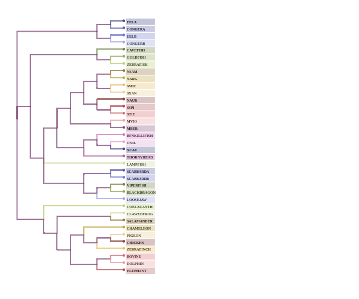
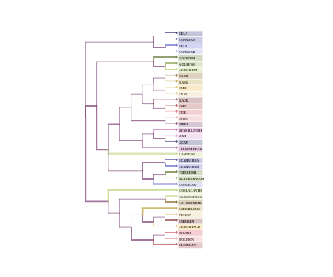
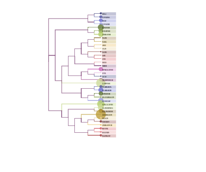
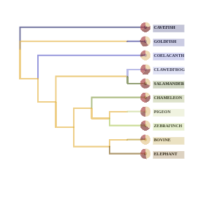
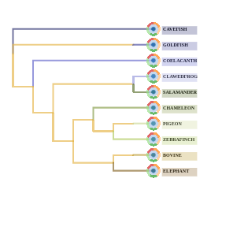
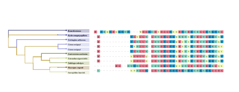
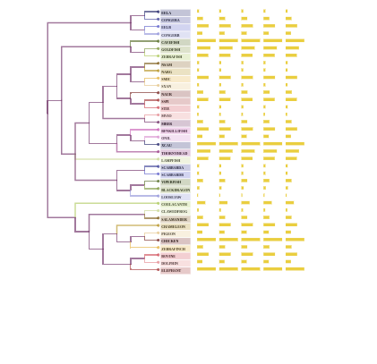
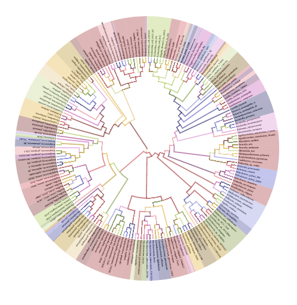

## Phylogenomics Visualization Library

* D3 based phylogenetic tree visualization library
* **Goal of visualization:**  
  * A library for phylogenetic tree visualization using [Newick format](https://en.wikipedia.org/wiki/Newick_format) file
  * A library which provides integration of phylogenetic tree with metadata or genomic data
  * Integration of genomic or metadata to create custom visualization (such as bar chart, heat-map, sequence alignment, etc.) along with the tree
  * Visualizing meta-information (quantitive and categorical)

### Demo [Phylogenomic Visualization](http://biographika.com/phylogenomics-viz/)

### External dependencies of phylogenomics visualization library

* [jQuery](https://jquery.com/)
* [D3](https://d3js.org/)


### Usage

#### Getting Started

1. Clone the repo:

    ```
    git clone https://github.com/biographika/phylogenomics-viz.git
    ```

2. Move into the directory:

    ```
    cd phylogenomics-viz
    ```

3. Run from a local web server:

    ```
    python -m SimpleHTTPServer 8080 &
    ```

#### Denrdogram module

`dendroGram` is a reusable d3.js module which creates a resizable SVG container:

```javascript
// Creating module object with default values
var dendroChart = dendroGram();

// Changing width, height or other exports object
var dendroChart = dendroGram()
              .width(1200)
              .height(700);

// Creating module object with option object
var opt = {
              weightLinks : true,
              linkValue : false,
              linkName : false,
              nodeSize : false,
              legend: false,
              noLinkExtend: false,
              treeType: 'linear',	// linear/radial type
              subTree: false		// Only for linear mode
          };

var dendroChart = dendroGram()
        .options(opt);

// load a newick data file
d3.text('/data/newick_tree.txt', function(tree){

  // calling module to create chart
  var chartContainer = d3.select("#svg_id")
       .datum(tree)
       .call(dendroChart);
})
```

#### Adding metadata

```javascript
// bar chart data
var data = [
  {Name:"A", value:42},
  {Name:"B", value:60},
  {Name:"C", value:23},
  {Name:"D", value:122}
];

var dendroChart = dendroGram()
  .barData(data);	// adding bar chart data to module

// calling module to create chart
d3.json('/data/newick_tree.txt', function(data){

  var chartContainer = d3.select("#svg_id")
  	.datum(tree)
    .call(dendroChart);
})
```

#### Creating a basic phylogenetic tree visualization application

Create an HTML file with this content:

```html
<head>
    <link rel="stylesheet" type="text/css" href="tree.css">
    <script src="https://code.jquery.com/jquery-3.1.1.min.js"></script>
    <script src="https://cdnjs.cloudflare.com/ajax/libs/d3/3.5.6/d3.min.js"></script>
    <script src="js/phyloGramD3.min.js"></script>
</head>

<body>
  <div id="phylogram"></div>
  // Calling module in javascript in html <body>  inside script tag
  <script type="text/javascript">

  d3.json('/data/newick_tree.txt', function(data){

    var treeView = dendroGram();
    var container = d3.select("#phylogram")
      .datum(data)
      .call(treeView);
  });
  </script>

</body>
```


### Screenshots

<table style="border-spacing: 0px">
  <tr>
    <td style="text-align:center;padding: 20px;border: 1px solid #999;"><a><br/>Dendrogram</a></td>
    <td style="text-align:center;padding: 20px;border: 1px solid #999;"><a><br/>Tree with link weight</a></td>
  </tr>
  <tr>
    <td style="text-align:center;padding: 20px;border: 1px solid #999;"><a><br/>Tree with node weight</a></td>
    <td style="text-align:center;padding: 20px;border: 1px solid #999;"><a><br/>Tree with pie chart </a></td>
  </tr>
  <tr>
    <td style="text-align:center;padding: 20px;border: 1px solid #999;"><a><br/>Tree with sunburst</a></td>
    <td style="text-align:center;padding: 20px;border: 1px solid #999;"><a><br/>Tree with alignment sequence</a></td>
  </tr>
  <tr>
    <td style="text-align:center;padding: 20px;border: 1px solid #999;"><a><br/>Tree with bar chart</a></td>
     <td style="text-align:center;padding: 20px;border: 1px solid #999;"><a><br/>Radial Tree</a></td>
  </tr>
</table>
